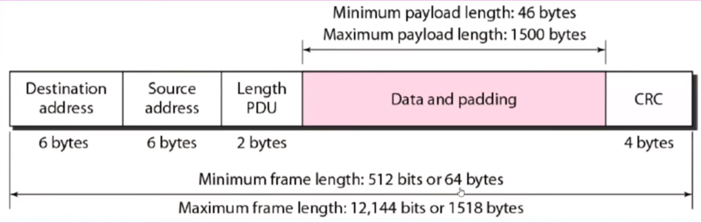

Layer 2 Ethernet sockets in C++ on Linux (Raspberry Pi 5 running Debian 13)

The code will send and receive a packet over Ethernet using a device's MAC address.

Ethernet Frame has 14 bytes for header+ CRC, plus a minimum of 46 bytes for payload.
We will build the ethernet frame manually in sendFrame function
  

## Build and Run 
```
mkdir build && cd build
cmake ..
make
```
## To Receive Packets
sudo ./mainEthernet eth0 recv

## To Send Packets
sudo ./mainEthernet eth0 send AA:BB:CC:DD:EE:FF "Hello from Raspberry Pi"


Replace AA:BB:CC:DD:EE:FF with destination MAC address.

eth0 to use ethernet, wlan0 to use WiFi.

‘ip link show’ in terminal to see available interfaces.

to send experimential ethernet packet from a Windows PC to Raspberry Pi , install Npcap, in PowerShell install Scapy
```
pip install scapy
```
Enter command below in PowerShell
```
python -c "from scapy.all import *; conf.use_npcap = True; sendp(Ether(src='AA:AA:AA:CC:BB:AA', dst='AA:BB:CC:DD:AA:AA', type=0x88B5)/Raw('Hello World'), iface='Ethernet 3', loop=1, inter=0.5)"
```

you can send over IPv4 as ICMP packet (ping), in PowerShell enter

```
python -c "from scapy.all import *; send(IP(dst='192.168.1.165')/ICMP()/Raw('Hello World'), loop=1, inter=1)"
```